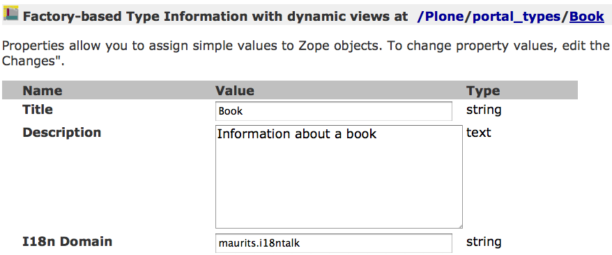
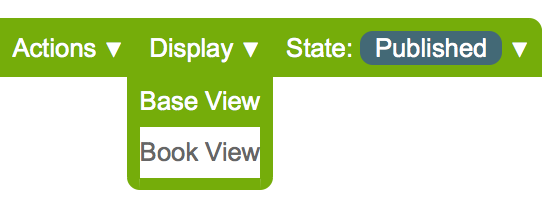

Internationalization in your package
====================================

.. This may become the text of my talk.  Or the presentation that I
.. will show.  I might switch to KeyNote or whatever.  We'll see.

Maurits van Rees

Zest Software, The Netherlands

Sample code:
https://github.com/mauritsvanrees/maurits.i18ntalk

Contents
--------

.. I probably want to replace this with something nicer, but for now
.. it will do.

.. contents::

What is internationalization?
-----------------------------

``i18n`` means making the web interface appear translated in your local
language instead of the default English.

No localization (``l10n``).

No multilingual sites.

.. I will not talk about localization (``l10n``), which means making
.. dates, times and currency appear in the format preferred in your
.. local language.

.. This is also not about multilingual sites, sites that have content
.. in both English and Dutch.  See ``Products.LinguaPlone`` or
.. ``plone.app.multilingual`` for that.

.. Maybe add two screen shots, in English and Dutch, just to make it
.. really clear.

Procedure
---------

.. If you add new strings in your package, you need to follow these
.. steps each time:

1. Make strings translatable.

2. Extract those strings with i18ndude into a po file (portable object).

3. Translate the strings in the .po file.

Strings in templates
--------------------

::

  <html ...
        xmlns:i18n="http://xml.zope.org/namespaces/i18n"
        i18n:domain="maurits.i18ntalk">

    A simple message

    
This is a message.

    Label:
    <tal:block tal:content="some_content" />

    

      A message in the plone domain.
    

  </html>

Extracted messages
------------------

In the ``.pot/.po`` file it becomes this::

  #: browser/test.pt:3
  msgid "A simple message"
  msgstr "Een eenvoudige boodschap"

  #. Default: "This is a message string."
  #: ./browser/bookview.pt:14
  msgid "msg_string"
  msgstr "Dit is een boodschap."

Fuzzy messages
--------------

These are not used::

  #. Default: "This is a message."
  #: ./browser/bookview.pt:15
  #, fuzzy
  msgid "msg_string"
  msgstr "Dit is een boodschap."

Dynamic content in templates
----------------------------

::

  

    This book has
    <tal:block i18n:name="stars"
               tal:content="context/getStars" />
    stars.
  

  #: browser/test.pt:9
  msgid "This book has ${stars} stars."
  msgstr "Dit boek heeft ${stars} sterren."

If you forget the ``i18n:name`` you get this in your ``.po`` file::

  msgid "This book has ${DYNAMIC_CONTENT} stars."
  msgstr "Dit boek heeft ${DYNAMIC_CONTENT} sterren."

And this translation does not show up.

Strings in Python
-----------------

``__init__.py``::

  from zope.i18nmessageid import MessageFactory
  i18ntalkMF = MF('maurits.i18ntalk')

In your python file::

  from maurits.i18ntalk import i18ntalkMF as _
  ...
      def title(self):
          return _(u"My latest books")

In a template::

  

Dynamic content in Python
-------------------------

::

  def book_message(self):
      number = 42
      return _(u"There are ${books} books in total.",
               mapping={'books': number})

In a template::

  

po file::

  #: ./portlets/mybooks.py:77
  msgid "There are ${books} books in total."
  msgstr "Er zijn in totaal ${books} boeken."

Explicit translations
---------------------

::

  from zope.i18n import translate
  msg = _("My books portlet is displayed.")
  translation = translate(msg, context=self.request)
  logger.info(translation)

  # def translate(msgid, domain=None, mapping=None,
  #   context=None, target_language=None, default=None):

Strings in GenericSetup
-----------------------

``profiles/default/types/Book.xml``::

  <?xml version="1.0"?>
  <object name="Book"
     meta_type="Factory-based Type Information with dynamic views"
     i18n:domain="maurits.i18ntalk"
     xmlns:i18n="http://xml.zope.org/namespaces/i18n">
    <property name="title" i18n:translate="">Book</property>
    <property name="description"
      i18n:translate="">Information about a book</property>

Problems:

- Is it used?

- Which domain?
  http://maurits.vanrees.org/weblog/archive/2010/10/i18n-plone-4

In GenericSetup files, use your own domain for::

  actions.xml
  controlpanel.xml
  types/YourType.xml

In GenericSetup files, use the plone domain for::

  portal_atct.xml
  portlets.xml
  workflows/your_workflow/definition.xml

Strings in ZCML
---------------

``configure.zcml``::

  <configure
      xmlns:genericsetup="http://namespaces.zope.org/genericsetup"
      i18n_domain="maurits.i18ntalk">

    <genericsetup:registerProfile
        name="default"
        title="Maurits' i18n talk"
        directory="profiles/default"
        description="Demo package for i18n talk by Maurits at ploneconf 2012"
        provides="Products.GenericSetup.interfaces.EXTENSION"
        />

- How to extract?  i18ndude does not support this (yet).

Display menu item
-----------------

::

  <configure
      xmlns="http://namespaces.zope.org/zope"
      xmlns:browser="http://namespaces.zope.org/browser"
      i18n_domain="maurits.i18ntalk">
    <include package="plone.app.contentmenu" />
    <browser:page
        for="maurits.i18ntalk.interfaces.IBook"
        name="book_view"
        class=".bookview.BookView"
        template="bookview.pt"
        permission="zope.Public"
        />
    <browser:menuItem
        for="maurits.i18ntalk.interfaces.IBook"
        menu="plone_displayviews"
        title="Book View"
        action="@@book_view"
        />
  </configure>

.. The ``@@`` signs are optional.

The structure and contents of the locales directory.
----------------------------------------------------

::

  locales
  locales/yourdomain.pot
  locales/manual.pot
  locales/plone.pot
  locales/nl
  locales/nl/LC_MESSAGES
  locales/nl/LC_MESSAGES/yourdomain.po
  locales/nl/LC_MESSAGES/plone.po

Register the locales in zcml.
-----------------------------

::

  <configure
      xmlns="http://namespaces.zope.org/zope"
      xmlns:i18n="http://namespaces.zope.org/i18n">

   <i18n:registerTranslations directory="locales" />

  </configure>

Installing i18ndude.
--------------------

buildout.cfg::

  [i18ndude]
  recipe = zc.recipe.egg
  eggs = i18ndude

script to update the locales
----------------------------

update_locales.sh::

  #! /bin/sh

  DOMAIN="maurits.i18ntalk"

  # Synchronise the templates and scripts with the .pot.  All on one
  # line normally.  And notice the dot at the end, for the current
  # directory.
  i18ndude rebuild-pot --pot locales/${DOMAIN}.pot \
      --create ${DOMAIN} \
      --merge locales/manual.pot \
      .

  # Synchronise the resulting .pot with all .po files
  for po in locales/*/LC_MESSAGES/${DOMAIN}.po; do
      i18ndude sync --pot locales/${DOMAIN}.pot $po
  done

  # Same for the plone domain.
  for po in locales/*/LC_MESSAGES/plone.po; do
      i18ndude sync --pot locales/plone.pot $po
  done

Headers
-------

::

  # Maurits van Rees <maurits@vanrees.org>, 2012.
  msgid ""
  msgstr ""
  "Project-Id-Version: maurits.i18ntalk 1.0\n"
  "POT-Creation-Date: 2012-10-02 15:46+0000\n"
  "PO-Revision-Date: 2012-10-01 13:49 +0200\n"
  "Last-Translator: Maurits van Rees <maurits@vanrees.org>\n"
  "Language-Team: Plone Nederland <plone-nl@lists.plone.org>\n"
  "MIME-Version: 1.0\n"
  "Content-Type: text/plain; charset=utf-8\n"
  "Content-Transfer-Encoding: 8bit\n"
  "Plural-Forms: nplurals=1; plural=0\n"
  "Language-Code: nl\n"
  "Language-Name: Nederlands\n"
  "Preferred-Encodings: utf-8 latin1\n"
  "Domain: maurits.i18ntalk\n"

Language-Code and Domain are ignored in locales.

Check it::

  msgfmt -c locales/nl/LC_MESSAGES/maurits.i18ntalk.po

buildout:cfg
------------

::

  [instance]
  recipe = plone.recipe.zope2instance
  locales = ${buildout:directory}/locales
  environment-vars =
      PTS_LANGUAGES en nl
      zope_i18n_allowed_languages en nl
      zope_i18n_compile_mo_files true

The locales option is there since Plone 4.2.1.

If you specify PTS_LANGUAGES and do *not* specify
zope_i18n_allowed_languages, then you will use about 50 MB more
memory.  So either specify them both or not at all.

Note that on Plone 3 the ``zope_i18n_*`` options have no effect.
Specifying PTS_LANGUAGES actually *increases* your memory usage by about
6 MB in Plone 3.3.  In Plone 3.1 it reduces it by about 7 MB.  If you
use add-ons, these numbers will increase.  I have seen a 30 MB difference.

Include the mo files
--------------------

``MANIFEST.in``::

  recursive-include collective *
  recursive-include docs *
  include *
  global-exclude *.pyc

Releasing a package
-------------------

easy_install or pip::

  easy_install zest.releaser zest.pocompile

buildout::

  [release]
  recipe = zc.recipe.egg
  eggs =
      zest.releaser
      zest.pocompile

Extra translations
------------------

Just add a file::

  your/package/locales/nl/LC_MESSAGES/plone.po

Overriding existing translations
--------------------------------

Order of loading::

  $ cat parts/instance/etc/site.zcml 
  <configure
    ...
    <!-- Load the configuration -->
    <include files="package-includes/*-configure.zcml" />
    <five:loadProducts />

1. locales = ``${buildout:directory}/locales``

2. zcml = your.package

3. Products alphabetically until and including Products.CMFPlone

4. packages with z3c.autoinclude

5. rest of the Products

6. i18n folders (done by PlacelessTranslationService)

Babel instead of i18ndude
-------------------------

``buildout.cfg``::

  [babelpy]
  recipe = zc.recipe.egg
  eggs =
      babel
      lingua
  interpreter = babelpy

``setup.cfg``::

  [extract_messages]
  keywords = _
  mapping_file = extract.ini
  output_file = maurits/i18ntalk/locales/maurits.i18ntalk.pot
  sort_output = true

``extract.ini``::

  [lingua_python: **.py]

  [lingua_xml: **.pt]

  [lingua_xml: **.xml]

  [lingua_zcml: **.zcml]

Usage::

  bin/babelpy setup.py extract_messages

- Good: has zcml support

- Bad: currently extracts *all* domains

Expected changes in the future.
-------------------------------

- `No more`_ ``i18n:translate="some_message_id"``.

- Babel instead of i18ndude?

- Sprint: support extracting zcml in i18ndude?
  Code: https://github.com/collective/i18ndude

.. _`No more`: http://plone-regional-forums.221720.n2.nabble.com/Plone-s-gettext-approach-and-its-impact-on-translation-td5670027.html

Questions
---------

Was anything unclear?  Anything you have missed?
